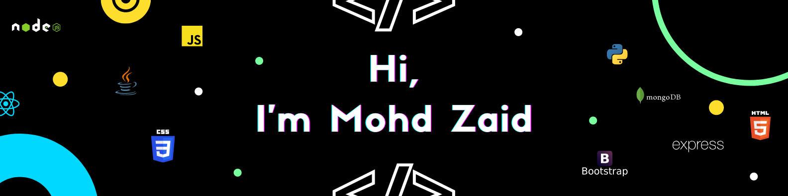
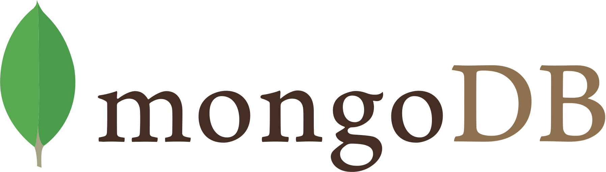

### About Me
I am a 1st year Computer Science student of SRM Institute of Science and Technology. I am a coding enthusiast who likes to take up challenges. I am finding my way through the industry and my passion to learn new concepts is what drives me forward.

### Languages and Skills
&nbsp;&nbsp;&nbsp;
<a href="#">

      &nbsp;&nbsp;&nbsp;

      &nbsp;&nbsp;&nbsp;

      &nbsp;&nbsp;&nbsp;

      &nbsp;&nbsp;&nbsp;

      &nbsp;&nbsp;&nbsp;

      &nbsp;&nbsp;&nbsp;

      &nbsp;&nbsp;&nbsp;

      &nbsp;&nbsp;&nbsp;

      &nbsp;&nbsp;&nbsp;
</a>

### 🌱 Currently Learning
- Backend Development using JS over Node/Express.

<h3>📫 Connect</h3>
</a>
&nbsp;&nbsp;&nbsp;&nbsp;&nbsp;&nbsp;&nbsp;&nbsp;
    <a href="https://www.instagram.com/zaid.js/" target="_blank">
    
    <a href="https://www.linkedin.com/in/mohd-zaid-17713221a/" target="_blank">
    &nbsp;&nbsp;&nbsp;&nbsp;&nbsp;&nbsp;
    
</a>
<!--
**zaidtab123/zaidtab123** is a ✨ _special_ ✨ repository because its `README.md` (this file) appears on your GitHub profile.

Here are some ideas to get you started:

- 🔭 I’m currently working on ...
- 🌱 I’m currently learning ...
- 👯 I’m looking to collaborate on ...
- 🤔 I’m looking for help with ...
- 💬 Ask me about ...
- 📫 How to reach me: ...
- 😄 Pronouns: ...
- ⚡ Fun fact: ...
-->
